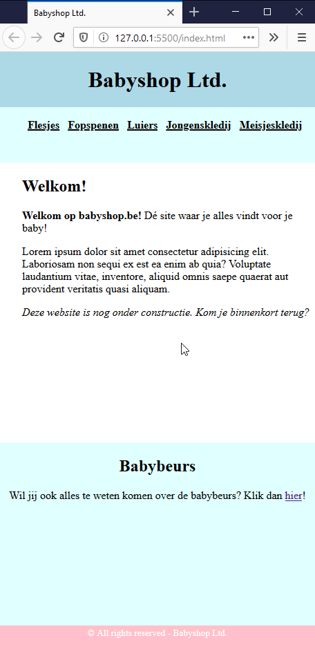

# oe-grid-babyshop-start
Oefening op grid layout

##  Opdracht
Je krijgt een HTML-pagina dat gebruik maakt van semantische elementen.
Schik de semantische elementen a.d.h.v. CSS grid voor zowel een desktopversie als een mobile versie.
Gebruik hiervoor media queries.
Schrijf indien nodig bijkomstige CSS.
**Aan de HTML mag niets aangepast worden!**

### Voorbeeld desktopversie

### Voorbeeld mobile versie

